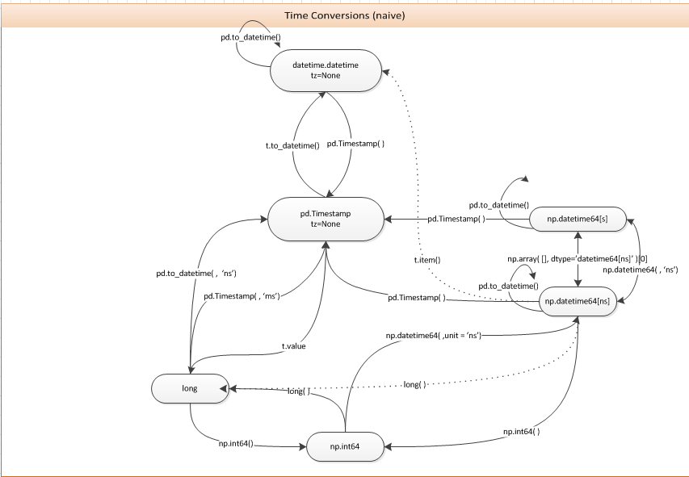

Motivation
==========

Static vs Dynamic Typing
------------------------
Python is a dynamically-typed language.  This design comes with a number of
noteworthy benefits, many of which have spurred the growth of Python as an
easy to use, general purpose programming language.  Simultaneously, it is also
the basis for most of the major complaints against Python as just such a
language.  Python is too slow?  Blame dynamic typing.  Python uses too much
memory?  Blame dynamic typing (and reference counting).  Python is buggy?
*Blame dynamic typing.*

In order to avoid these problems, production code is often lifted out of python
entirely, implemented in some other statically-typed language (usually C), and
then reintroduced to python by way of the CPython interface or a compatibility
layer such as `Cython <https://cython.org/>`_,
`Jython <https://www.jython.org/>`_, `Numba <https://numba.pydata.org/>`_,
`RustPython <https://rustpython.github.io/>`_, or some other tool.  Now, this
is all well and good, but in so doing, one must make certain assumptions about
the data they are working with.  C integers, for instance, can be
platform-specific and may not fit arbitrary data without overflowing, like
python integers can.  Similarly, they are unable to hold missing values, which
are often encountered in real-world data.  Nevertheless, as long as one is
aware of these limitations going in, the benefits can be significant, and so it
is done regardless.

However, this presents an entirely new problem: one of translation.  Given the
fact that there is no direct C equivalent for the built-in python integer type,
how can we be sure that our inputs will fit within the limits of our
statically-typed functions?  If we were working with scalar values, we could
insert one or more ``isinstance()`` and/or range checks to work it out
manually, but this adds overhead to every function call, counteracting the
performance benefits we can expect to achieve. Of course we could just move
forward with the call and hope we don't encounter any problems, and 64 bits is
generally enough for most applications, but what if it's not?  What if we don't
know ahead of time?

This is a common problem in data science, where data cleaning and preprocessing
take up a significant fraction of one's time.  In this process, missing and
malformed values are the rule rather than the exception, and care must be taken
to treat them appropriately.  Most often, this involves a whole pipeline of
data visualizations, normalization, cuts, biases, conversions, projections,
smoothing, and anything else a data scientist might keep in their toolkit for
just such an occassion.

Paradoxically, this is also the exact case where performance matters most,
especially in the era of big data.  As such, one should be looking to use
statically-typed acceleration wherever possible, and indeed this is exactly
what the two most common data analysis packages (numpy and pandas) do by
default.  It is important to state, however, that they do not eliminate the
problems that arise when converting from dynamic to static typing; they merely
bury them beneath an extra layer of abstraction.  Occasionally, they still rear
their ugly heads.

Limitations of Numpy/Pandas
---------------------------
Consider a pandas Series containing the integers 1 through 3:

.. doctest:: limitations

    >>> import pandas as pd

    >>> pd.Series([1, 2, 3])
    0    1
    1    2
    2    3
    dtype: int64

By default, this is automatically converted to a 64-bit integer data type, as
represented by its corresponding ``dtype`` field, like so:

.. doctest:: limitations

    >>> pd.Series([1, 2, 3]).dtype
    dtype('int64')

If we request a value at a specific index of the series, it will be returned
as an ``int64`` object:

.. doctest:: limitations

    >>> val = pd.Series([1, 2, 3])[0]
    >>> print(type(val), val)
    <class 'numpy.int64'> 1

So far, so good.  But what if we add a missing value to the series?

.. doctest:: limitations

    >>> pd.Series([1, 2, 3, None])
    0    1.0
    1    2.0
    2    3.0
    3    NaN
    dtype: float64

It changes to ``float64``!  This happens because ``np.int64`` objects cannot
contain missing values.  There is no particular bit pattern in their binary
representation that can be reserved to hold special values like ``inf`` or
``NaN``.  This is not the case for floating point values, which restrict a
particular exponent specifically for such purposes.  Because of this
discrepancy, pandas silently converts our integer series into a float series to
accomodate the missing value.

Pandas does expose an ``Int64Dtype()`` object that bypasses this restriction,
but it must be set manually:

.. doctest:: limitations

    >>> pd.Series([1, 2, 3, None], dtype=pd.Int64Dtype())
    0       1
    1       2
    2       3
    3    <NA>
    dtype: Int64

This means that unless you are aware of it ahead of time, your data could very
well be converted to floats without your knowledge! Why is this a problem?
Well, let's see what happens when our integers are very large:

.. doctest:: limitations

    >>> pd.Series([2**63 - 3, 2**63 - 2, 2**63 - 1])
    0    9223372036854775805
    1    9223372036854775806
    2    9223372036854775807
    dtype: int64

These integers are very large indeed.  In fact, they are almost overflowing
their 64-bit buffer.  If we add 1 to this series, we might expect to
receive some kind of overflow error informing us of our potential mistake.  Do
we get such an error?

.. doctest:: limitations

    >>> pd.Series([2**63 - 3, 2**63 - 2, 2**63 - 1]) + 1
    0    9223372036854775806
    1    9223372036854775807
    2   -9223372036854775808
    dtype: int64

No, the data type stays 64-bits wide and we simply wrap around to the
negative side of the number line.  Again, if you aren't aware of this behavior,
you might have just introduced an outlier to your data set unexpectedly.

It gets even worse when you combine large integers with missing values:

.. doctest:: limitations

    >>> pd.Series([2**63 - 3, 2**63 - 2, 2**63 - 1, None])
    0    9.223372e+18
    1    9.223372e+18
    2    9.223372e+18
    3             NaN
    dtype: float64

As before, this converts our data into a floating point format.  What happens
if we add 1 to this series?

.. doctest:: limitations

    >>> pd.Series([2**63 - 3, 2**63 - 2, 2**63 - 1, None]) + 1
    0    9.223372e+18
    1    9.223372e+18
    2    9.223372e+18
    3             NaN
    dtype: float64

This time we don't wrap around the number line like before.  This is because in
floating point arithmetic, we have plenty of extra numbers to work with above
the normal 64-bit limit.  However, if we look at the values at each index, what
integers are we actually storing?

.. doctest:: limitations

    >>> series = pd.Series([2**63 - 3, 2**63 - 2, 2**63 - 1, None])
    >>> for val in series[:3]:
    ...     print(int(val))
    9223372036854775808
    9223372036854775808
    9223372036854775808

They're all the same!  This is an example of
`floating point rounding error <https://en.wikipedia.org/wiki/Round-off_error>`_
in action.  Each of our integers is above the integral range of ``float64``
objects, which is defined by the number of bits in their significand (53 in the
case of ``float64`` objects).  Only integers within this range can be exactly
represented with exponent 1, meaning that any integer outside the range
``(-2**53, 2**53)`` must increment the exponent and therefore lose exact
integer precision.  In this case it's even worse, since our values are ~10
factors of 2 outside that range, meaning that the exponent portion of our
floating points must be >= 10.  This leaves approximately ``2**10 = 1024``
values that we are masking with the above data.  We can confirm this by doing
the following:

.. doctest:: limitations

    >>> import numpy as np

    >>> val = np.float64(2**63 - 1)
    >>> i, j = 0, 0
    >>> while val + i == val:  # count up
    ...     i += 1
    >>> while val - j == val:  # count down
    ...     j += 1
    >>> print(f"up: {i}\ndown: {j}\ntotal: {i + j}")
    up: 1025
    down: 513
    total: 1538

So it turns out we have over 1500 different values within error of the observed
result.  Once more, if we weren't aware of this going in to our analysis, we
may have just unwittingly introduced a form of systematic error by accident.
This is not ideal!

.. note::

    The discrepancy from our predicted value of 1024 comes from the fact
    that ``2**63 - 1`` is on the verge of overflowing past its current
    exponent.  Once we reach ``2**63``, we must increment our exponent to 11,
    giving us twice as many values above ``2**63`` as below it.

pdcast: a safer alternative
-------------------------------
Let's see how ``pdcast`` handles the above example:

.. doctest:: pdcast_intro

    >>> import pdcast

    >>> pdcast.to_integer([1, 2, 3])
    0    1
    1    2
    2    3
    dtype: int64
    >>> pdcast.to_integer([1, 2, 3]).dtype
    dtype('int64')

So far this is exactly the same as before.  However, when we add missing
values, we will see how ``pdcast`` diverges from normal pandas:

.. doctest:: pdcast_intro

    >>> pdcast.to_integer([1, 2, 3, None])
    0       1
    1       2
    2       3
    3    <NA>
    dtype: Int64

Instead of coercing integers to floating point, we skip straight to the
``pd.Int64Dtype()`` implementation.  This doesn't just happen for ``int64``\s
either, it also applies for booleans and all other non-nullable data types.

.. doctest:: pdcast_intro

    >>> pdcast.to_boolean([True, False, None])
    0     True
    1    False
    2     <NA>
    dtype: boolean
    >>> pdcast.to_integer([1, 2, 3, None], "uint32")
    0       1
    1       2
    2       3
    3    <NA>
    dtype: UInt32

By avoiding a floating point intermediary, we can ensure that no data is lost
during these conversions, even if the values are very large:

.. doctest:: pdcast_intro

    >>> pdcast.to_integer([2**63 - 3, 2**63 - 2, 2**63 - 1, None])
    0    9223372036854775805
    1    9223372036854775806
    2    9223372036854775807
    3                   <NA>
    dtype: Int64

In fact, we can also represent integers beyond the normal limits of ``int64``
objects by dynamically upcasting.

.. doctest:: pdcast_intro

    >>> pdcast.to_integer([1, 2, 2**63, None])
    0                      1
    1                      2
    2    9223372036854775808
    3                   <NA>
    dtype: UInt64
    >>> pdcast.to_integer([1, 2, 2**64, None])
    0                       1
    1                       2
    2    18446744073709551616
    3                    <NA>
    dtype: object

.. and can even do math with them without worrying about overflow.

.. note::

    Overflow-safe arithmetic is not currently supported, but is intended for
    a future release.

Conversions
-----------
The problems we discussed earlier are multiplied tenfold when converting from
one representation to another.  This is where ``pdcast`` really shines.

Case study: integers & floats
^^^^^^^^^^^^^^^^^^^^^^^^^^^^^

Before we dive into the differences, let's see how pandas handles conversions
in cases of precision loss and/or overflow.  We'll start with our large
integers from before:

.. testsetup:: conversions

    import numpy as np
    import pandas as pd
    import pdcast

.. doctest:: conversions

    >>> series = pd.Series([2**63 - 3, 2**63 - 2, 2**63 - 1])
    >>> series
    0    9223372036854775805
    1    9223372036854775806
    2    9223372036854775807
    dtype: int64
    >>> series.astype(float)
    0    9.223372e+18
    1    9.223372e+18
    2    9.223372e+18
    dtype: float64

As we can see, pandas doesn't even emit a warning about the precision loss we
demonstrated previously.  If we reverse this conversion, we can see why that
could be a problem:

.. doctest:: conversions

    >>> series.astype(float).astype(int)
    0   -9223372036854775808
    1   -9223372036854775808
    2   -9223372036854775808
    dtype: int64

Note that we don't get our original data back.  In fact we don't even end
up on the same side of the number line, thanks to silent overflow.

So, simply by converting our data, we have implicitly changed its value.  In
contrast, ``pdcast`` requires explicit approval to change data in this way.

.. doctest:: conversions

    >>> import pdcast.attach

    >>> series.cast(float)
    Traceback (most recent call last):
        ...
    ValueError: precision loss exceeds tolerance 1e-06 at index [0, 1, 2]
    >>> series.cast(float, errors="coerce")
    0    9.223372e+18
    1    9.223372e+18
    2    9.223372e+18
    dtype: float64

And we can reverse our conversion without overflowing:

.. doctest:: conversions

    >>> series.cast(float, errors="coerce").cast(int)
    0    9223372036854775808
    1    9223372036854775808
    2    9223372036854775808
    dtype: uint64

Which preserves the actual value of the coerced floats.

What if we wanted to convert our series to ``int32`` rather than ``float``? 
Obviously the values won't fit, but what does pandas do in this situation?

.. doctest:: conversions

    >>> series
    0    9223372036854775805
    1    9223372036854775806
    2    9223372036854775807
    dtype: int64
    >>> series.astype(np.int32)
    0   -3
    1   -2
    2   -1
    dtype: int32

At this point, you might be tearing out your hair in frustration.  Not only
does pandas *not emit a warning* in this situation, but it also gives results
that are almost unintelligible and very likely not what we were expecting.

.. note::

    The actual values we observe here are due to the same overflow wrapping
    behavior as above, except that we're doing it with a smaller container
    (``2**32`` possible values vs ``2**64``).  This means that our
    nearly-overflowing 64-bit values wrap around the number line not just once,
    but *32 times* to arrive at their final result.

In contrast, ``pdcast`` is aware of this and raises an ``OverflowError`` as
you might expect.

.. doctest:: conversions

    >>> series.cast(np.int32)
    Traceback (most recent call last):
        ...
    OverflowError: values exceed int32[numpy] range at index [0, 1, 2]

If we try to coerce the previous operation, then the overflowing values will be
replaced with NAs to avoid biasing the result:

.. doctest:: conversions

    >>> series.cast(np.int32, errors="coerce")
    0    <NA>
    1    <NA>
    2    <NA>
    dtype: Int32

If any of our values *had* fit into the available range for ``int32`` objects,
they would have been preserved.

.. doctest:: conversions

    >>> pd.Series([1, 2, 3, 2**63 - 1]).cast(np.int32, errors="coerce")
    0       1
    1       2
    2       3
    3    <NA>
    dtype: Int32

Note that a nullable dtype is returned even though the original input had no
missing values.  ``pdcast`` knows when a value is being coerced and can adjust
accordingly.

Case study: datetimes
^^^^^^^^^^^^^^^^^^^^^

Now let's look at a different case: converting to and from **datetimes**.

You could slowly go insane doing this in pandas:

    (And that's just for timezone-naive datetimes)

Or you could let ``pdcast`` work out all the details for you:

.. doctest:: conversions

    >>> series = pd.Series([1, 2, 3])
    >>> series.cast("datetime", unit="s")
    0   1970-01-01 00:00:01
    1   1970-01-01 00:00:02
    2   1970-01-01 00:00:03
    dtype: datetime64[ns]

With expanded support for different epochs and timezones:

.. doctest:: conversions

    >>> series.cast("datetime", unit="ns", since="j2000", tz="US/Pacific")
    0   2000-01-01 04:00:00.000000001-08:00
    1   2000-01-01 04:00:00.000000002-08:00
    2   2000-01-01 04:00:00.000000003-08:00
    dtype: datetime64[ns, US/Pacific]
    >>> epoch = pd.Timestamp("2022-03-27 08:47:32.0123456789+0100")
    >>> series.cast("datetime", unit="h", since=epoch, tz="utc")
    0   2022-03-27 08:47:32.012345678+00:00
    1   2022-03-27 09:47:32.012345678+00:00
    2   2022-03-27 10:47:32.012345678+00:00
    dtype: datetime64[ns, UTC]

And calendar-accurate unit conversions:

.. doctest:: conversions

    >>> series.cast("datetime", unit="Y")  # 1972 was a leap year
    0   1971-01-01
    1   1972-01-01
    2   1973-01-01
    dtype: datetime64[ns]
    >>> series.cast("datetime", unit="M", since="utc")
    0   1970-02-01
    1   1970-03-01
    2   1970-04-01
    dtype: datetime64[ns]
    >>> series.cast("datetime", unit="M", since=pd.Timestamp("1972-01-01"))
    0   1972-02-01
    1   1972-03-01
    2   1972-04-01
    dtype: datetime64[ns]

Reversibly:

.. doctest:: conversions

    >>> series.cast("datetime", unit="h").cast(int, unit="h")
    0    1
    1    2
    2    3
    dtype: int64

From many representations:

.. doctest:: conversions

    >>> import decimal

    >>> bools = pd.Series([True, False])
    >>> floats = pd.Series([1.3, -4.8])
    >>> complex_numbers = pd.Series([1.3+0j, -4.8+0j])
    >>> decimals = pd.Series([decimal.Decimal(1.3), decimal.Decimal(-4.8)])
    >>> timedeltas = pd.Series([pd.Timedelta(days=1.3), pd.Timedelta(days=-4.8)])

    >>> bools
    0     True
    1    False
    dtype: bool
    >>> floats
    0    1.3
    1   -4.8
    dtype: float64
    >>> complex_numbers
    0    1.3+0.0j
    1   -4.8+0.0j
    dtype: complex128
    >>> decimals
    0    1.30000000000000004440892098500626161694526672...
    1    -4.7999999999999998223643160599749535322189331...
    dtype: object
    >>> timedeltas
    0               1 days 07:12:00
    1   -5 days +04:48:00.000000001
    dtype: timedelta64[ns]

    >>> bools.cast("datetime", unit="D")
    0   1970-01-02
    1   1970-01-01
    dtype: datetime64[ns]
    >>> floats.cast("datetime", unit="D")
    0   1970-01-02 07:12:00.000000000
    1   1969-12-27 04:48:00.000000001
    dtype: datetime64[ns]
    >>> complex_numbers.cast("datetime", unit="D")
    0   1970-01-02 07:12:00.000000000
    1   1969-12-27 04:48:00.000000001
    dtype: datetime64[ns]
    >>> decimals.cast("datetime", unit="D")
    0   1970-01-02 07:12:00.000000000
    1   1969-12-27 04:48:00.000000001
    dtype: datetime64[ns]
    >>> timedeltas.cast("datetime")
    0   1970-01-02 07:12:00.000000000
    1   1969-12-27 04:48:00.000000001
    dtype: datetime64[ns]

To many representations:

.. doctest:: conversions

    >>> boolean_datetimes = pd.to_datetime(pd.Series([1, 0]), unit="D")
    >>> numeric_datetimes = pd.to_datetime(pd.Series([1.3, -4.8]), unit="D")

    >>> boolean_datetimes
    0   1970-01-02
    1   1970-01-01
    dtype: datetime64[ns]
    >>> numeric_datetimes
    0   1970-01-02 07:12:00
    1   1969-12-27 04:48:00
    dtype: datetime64[ns]

    >>> boolean_datetimes.cast(bool, unit="D")
    0     True
    1    False
    dtype: bool
    >>> numeric_datetimes.cast(float, unit="D")
    0    1.3
    1   -4.8
    dtype: float64
    >>> numeric_datetimes.cast(complex, unit="D")
    0    1.3+0.0j
    1   -4.8+0.0j
    dtype: complex128
    >>> numeric_datetimes.cast(decimal.Decimal, unit="D")
    0     1.3
    1    -4.8
    dtype: object
    >>> numeric_datetimes.cast("timedelta", unit="D")
    0     1 days 07:12:00
    1   -5 days +04:48:00
    dtype: timedelta64[ns]

With arbitrary string parsing:

And support for several different datetime representations:

.. doctest:: conversions

    >>> series.cast("datetime[pandas]", unit="s", since="jan 30 2022 at 7 AM")
    0   2022-01-30 07:00:01
    1   2022-01-30 07:00:02
    2   2022-01-30 07:00:03
    dtype: datetime64[ns]
    >>> series.cast("datetime[python]", unit="D", since="modified julian", tz="Asia/Hong_Kong")
    0    1858-11-17 07:37:00+07:37
    1    1858-11-18 07:37:00+07:37
    2    1858-11-19 07:37:00+07:37
    dtype: object
    >>> series.cast("datetime[numpy]", unit="Y", since="-4713-11-24 12:00:00")
    0    -4712-11-24T12:00:00.000000
    1    -4711-11-24T12:00:00.000000
    2    -4710-11-24T12:00:00.000000
    dtype: object

Without worrying about overflow:

.. doctest:: conversions

    >>> import datetime

    >>> series.cast("datetime", unit="us", since=pd.Timestamp.max)
    0    2262-04-11 23:47:16.854776
    1    2262-04-11 23:47:16.854777
    2    2262-04-11 23:47:16.854778
    dtype: object
    >>> _[0]
    datetime.datetime(2262, 4, 11, 23, 47, 16, 854776)
    >>> series.cast("datetime", unit="s", since=datetime.datetime.max)
    0    10000-01-01T00:00:00.999999
    1    10000-01-01T00:00:01.999999
    2    10000-01-01T00:00:02.999999
    dtype: object
    >>> _[0]
    numpy.datetime64('10000-01-01T00:00:00.999999')

.. note::

    ``pdcast`` doesn't just handle homogenous data - it can even process
    inputs that are of mixed type using a split-apply-combine strategy.
    Elements are grouped by their inferred type, converted independently, and
    then stitched together along with missing values to achieve the final
    result.

    .. doctest:: conversions

        >>> mixed_data = [2**63, "1979", True, 4+0j, decimal.Decimal(18), None]
        >>> pdcast.to_integer(mixed_data)
        0    9223372036854775808
        1                   1979
        2                      1
        3                      4
        4                     18
        5                   <NA>
        dtype: UInt64
        >>> pdcast.to_datetime(mixed_data)
        0       2262-04-11 23:47:16.854775
        1              1979-01-01 00:00:00
        2    1970-01-01 00:00:00.000000001
        3    1970-01-01 00:00:00.000000004
        4    1970-01-01 00:00:00.000000018
        5                             <NA>
        dtype: object

.. testcleanup:: conversions

    # detach pdcast for next section
    pdcast.attach.detach()

Inference & Validation
----------------------
Another area where pandas could be improved is in runtime type-checking.
Baseline, it includes a number of utility functions under ``pd.api.types`` that
are meant to do this, but each of them essentially boils down to a naive
``.dtype`` check.  This leads to questionable (and even inaccurate) results,
such as:

.. testsetup:: inference

    import decimal
    import numpy as np
    import pandas as pd
    import pdcast

.. doctest:: inference

    >>> series = pd.Series([decimal.Decimal(1), decimal.Decimal(2)], dtype="O")
    >>> pd.api.types.is_string_dtype(series)
    True

This happens because pandas stores strings as generic python objects by
default.  We can see this by creating a basic string series.

.. doctest:: inference

    >>> pd.Series(["foo", "bar", "baz"])
    0    foo
    1    bar
    2    baz
    dtype: object

Note that the series is returned with ``dtype=object``.  This ambiguity means
that ``pd.api.types.is_string_dtype()``, which implies specificity to strings,
has to include ``dtype=object`` in its comparison.  Because of this, **any
series with** ``dtype=object`` **will be counted as a string series**, even
if it *does not* contain strings.  This is confusing to say the least, and
makes it practically impossible to distinguish between genuine object arrays
and those containing only strings.

Pandas does have a specialized ``pd.StringDtype()`` just to represent strings,
but - like with ``pd.Int64Dtype()`` - it must be set manually, and is often
ignored in practice.  With this dtype, we can unambiguously check for strings
by doing:

.. doctest:: inference

    >>> series1 = pd.Series(["foo", "bar", "baz"], dtype=pd.StringDtype())
    >>> series2 = pd.Series([decimal.Decimal(1), decimal.Decimal(2)], dtype="O")
    >>> pd.api.types.is_string_dtype(series1) and not pd.api.types.is_object_dtype(series1)
    True
    >>> pd.api.types.is_string_dtype(series2) and not pd.api.types.is_object_dtype(series2)
    False

But this is long and unwieldy, not to mention requiring a preprocessing step
to work at all.

``pdcast`` has a better solution:

.. doctest:: inference

    >>> import pdcast.attach

    >>> series1.typecheck("string")
    True
    >>> series2.typecheck("string")
    False

And it even works on ``dtype=object`` series:

.. doctest:: inference

    >>> series = pd.Series(["foo", "bar", "baz"])
    >>> series
    0    foo
    1    bar
    2    baz
    dtype: object
    >>> series.typecheck("string")
    True

This is accomplished by a combination of *inference* and *validation*.
Inference is performed by ``pdcast.detect_type()``, which essentially
vectorizes the built-in ``type()`` function and applies it elementwise over an
iterable.

.. doctest:: inference

    >>> pdcast.detect_type(series)
    StringType()

This yields an unambiguous ``StringType()`` representing the actual observed
elements of ``series``.  Since we don't have to rely on a potentially
inaccurate ``.dtype`` check to do this inferencing, it can be applied to
arbitrary data.

.. doctest:: inference

    >>> class CustomObj:
    ...     def __init__(self, x):
    ...         self.x = x

    >>> pdcast.detect_type(pd.Series([decimal.Decimal(1), decimal.Decimal(2)]))
    PythonDecimalType()
    >>> pdcast.detect_type(pd.Series([1, 2, 3]))
    NumpyInt64Type()
    >>> pdcast.detect_type(pd.Series([CustomObj("python"), CustomObj("is"), CustomObj("awesome")]))
    ObjectType(type_def=<class 'CustomObj'>)

We can even infer types for non-homogenous data this way:

.. doctest:: inference

    >>> series = pd.Series([decimal.Decimal(1), 2, CustomObj("awesome")])
    >>> series   # doctest: +SKIP
    0                                                1
    1                                                2
    2    <__main__.CustomObj object at 0x7fe8add30520>
    dtype: object
    >>> pdcast.detect_type(series)   # doctest: +SKIP
    CompositeType({decimal[python], int, object[__main__.CustomObj]})

.. note::

    ``pdcast.detect_type()`` isn't picky about its inputs.  It can accept any
    scalar or iterable, not just ``pd.Series`` objects.

    If an input has an appropriate ``.dtype`` field, and that dtype is *not* an
    ``object`` type, then ``pdcast.detect_type()`` will attempt to use it
    directly. This is an O(1) operation regardless of how big the iterable is.

Now that we know the element type of our input, we just need to resolve the
comparison type and check whether one contains the other.  We can do this by
leveraging the :ref:`type specification mini language <mini_language>` or
by using any `numpy <https://numpy.org/doc/stable/reference/arrays.dtypes.html>`_
-compatible `dtype specifier <https://numpy.org/doc/stable/user/basics.types.html#data-types>`_,
passing it to ``pdcast.resolve_type()`` like so:

.. doctest:: inference

    >>> pdcast.resolve_type("int")
    IntegerType()
    >>> pdcast.resolve_type("signed[numpy]")
    NumpySignedIntegerType()
    >>> pdcast.resolve_type("?")
    BooleanType()
    >>> pdcast.resolve_type(np.dtype("f4"))
    NumpyFloat32Type()
    >>> pdcast.resolve_type(pd.Int64Dtype())
    PandasInt64Type()
    >>> pdcast.resolve_type(complex)
    ComplexType()

``pdcast.typecheck()`` implicitly calls this on its first argument.

.. note::

    ``pdcast.resolve_type()`` accepts a superset of the existing ``np.dtype()``
    syntax, meaning that any specifier that is accepted by numpy can also be
    accepted by ``pdcast``.

Once both the observed element type and the specified comparison type have been
resolved, validating them consists of a simple membership test.

.. doctest:: inference

    >>> resolved = pdcast.resolve_type("int")
    >>> resolved
    IntegerType()
    >>> inferred = pdcast.detect_type(pd.Series([1, 2, 3]))
    >>> inferred
    NumpyInt64Type()
    >>> resolved.contains(inferred)
    True

By default, this also applies to any subtypes of the comparison type.

.. doctest:: inference

    >>> resolved = pdcast.resolve_type("int")
    >>> resolved
    IntegerType()
    >>> inferred = pdcast.detect_type(pd.Series([1, 2, 3], dtype="i2"))
    >>> inferred
    NumpyInt16Type()
    >>> resolved.contains(inferred)
    True

This returns ``True`` because ``int16[numpy]`` is a subtype of ``int``.  In
this manner, ``pdcast.typecheck()`` operates in a way similar to the built-in
``isinstance()`` function, extending it to vectorized data.

.. TODO: talk about exact comparisons and the use of composite types

.. testcleanup:: inference

    pdcast.attach.detach()

Expanded Support
----------------
.. decimal w/ dispatched round() method
.. datetime w/ datetime[python], datetime[numpy], .dt.tz_localize/convert()
