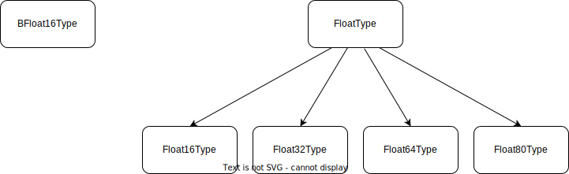
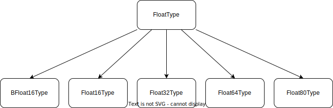

.. _tutorial:

Tutorial: bfloat16
==================
This tutorial will walk through the necessary steps to define and integrate a
new type into the ``pdcast`` ecosystem.  By the end of it, you should be able
to build arbitrary object types to use with ``cast()``, ``check_type()``, and
other dispatched methods as you see fit.

"Brain" floats
--------------
The ``bfloat16`` data type was
`developed by Google <https://arxiv.org/pdf/1905.12322.pdf>`_ as a
high-performance alternative to half- and single-precision floating point
numbers for machine learning applications.  These "brain" floats have a wider
range of allowable exponents, but fewer bits in their significand than the
traditional `IEEE 754 specification <https://en.wikipedia.org/wiki/IEEE_754>`_.
This allows them to represent larger values at the cost of reduced precision
compared to equivalent ``float16`` objects.  This tradeoff is desirable in the
case of machine learning cost computations, where precision is relatively
unimportant compared to speed and memory efficiency.

`Tensorflow <https://www.tensorflow.org/>`_, one of the primary frameworks for
deep learning, allows us to implement these bfloat16 types in normal python.

.. doctest::

    >>> import tensorflow as tf
    >>> tf_bfloat16 = tf.bfloat16.as_numpy_dtype  # get base class
    >>> tf_bfloat16(1.2)
    1.20312
    >>> print(f"{np.float16(1.2):.6f}")  # equivalent float16 for comparison
    1.200195

This tutorial will walk through the process of adding these objects to pandas
via ``pdcast``.

Creating a new type definition
------------------------------
The first order of business when defining a new type is to create a subclass of
``AtomicType``.  This can be done from anywhere - the new type will be
automatically discovered during registration.

We'll start from the beginning and work our way up.

.. doctest::

    >>> import numpy as np
    >>> import pdcast
    >>> class BFloat16Type(pdcast.AtomicType):
    ...    name = "bfloat16"
    ...    aliases = {"bfloat16", "brain float", tf_bfloat16, tf.bfloat16}
    ...    type = tf_bfloat16
    ...    itemsize = 2
    ...    na_value = np.nan

This gives us a rudimentary type object that contains all the necessary
information to construct ``bfloat16``-based AtomicTypes.

.. doctest::

    >>> BFloat16Type.instance()
    BFloat16Type()
    >>> BFloat16Type.instance() is BFloat16Type.instance()
    True
    >>> BFloat16Type.flyweights
    {'bfloat16': BFloat16Type()}

Note that just because we inherited from AtomicType, the new type has not yet
been added to ``resolve_type()`` or ``detect_type()``.

.. doctest::

    >>> pdcast.resolve_type("bfloat16")
    Traceback (most recent call last):
        ...
    ValueError: could not interpret type specifier: 'bfloat16'
    >>> pdcast.detect_type(tf_bfloat16(1.2))
    ObjectType(type=<class 'bfloat16'>)

To change this, we have to register the type, validating its structure and
linking its aliases to the aforementioned functions.

.. doctest::

    >>> @pdcast.register
    ... class BFloat16Type(pdcast.AtomicType):
    ...    name = "bfloat16"
    ...    aliases = {"bfloat16", "brain float", tf_bfloat16, tf.bfloat16}
    ...    type = tf_bfloat16
    ...    itemsize = 2
    ...    na_value = np.nan

If the above does not trigger a TypeError, then our type is considered valid
and will be accepted by ``resolve_type()`` and ``detect_type()`` operations.
Now when we run them again, they should return our new ``BFloat16Type``
objects.

.. doctest::

    >>> pdcast.resolve_type("bfloat16")
    BFloat16Type()
    >>> pdcast.detect_type(tf_bfloat16(1.1))
    BFloat16Type()
    >>> pdcast.resolve_type("bfloat16") is pdcast.resolve_type("bfloat16")
    True
    >>> pdcast.detect_type(tf_bfloat16(1.2)) is pdcast.detect_type(tf_bfloat16(2.3))
    True

Registering subtypes
--------------------
Theoretically, if all we wanted to do was exact schema checks using our new
``BFloat16Type``, then we could stop here.  However, it would be nice to
integrate it with the existing type hierarchies.

Currently, our ``BFloat16Type`` exists as a *root type*.  This means that it
has no supertypes, and is not included in any other type's ``.subtypes`` tree.

.. doctest::

    >>> pdcast.resolve_type("bfloat16").supertype is None
    True
    >>> pdcast.resolve_type("float").contains("bfloat16")
    False

We can fix this by appending an ``@subtype`` decorator to our ``BFloat16Type``
definition, which specifies it as a member of the ``FloatType`` family.

.. testsetup::

    # first we have to remove the previous definition.  Usually this isn't
    # necessary, since types are only defined once.
    pdcast.AtomicType.registry.remove(BFloat16Type)

.. doctest::

    >>> @pdcast.register
    ... @pdcast.subtype(pdcast.FloatType)
    ... class BFloat16Type(pdcast.AtomicType):
    ...    name = "bfloat16"
    ...    aliases = {"bfloat16", "brain float", tf_bfloat16, tf.bfloat16}
    ...    type = tf_bfloat16
    ...    itemsize = 2
    ...    na_value = np.nan

Now, if we repeat our membership checks, we see that ``BFloat16Type`` has been
added to the ``FloatType`` hierarchy.

.. doctest::

    >>> pdcast.resolve_type("bfloat16").supertype
    FloatType()
    >>> pdcast.resolve_type("float").contains("bfloat16")
    True

If we were to visualize this, the ``@subtype`` decorator would take us from
this:

To this:

Allowing multiple backends
--------------------------
So far, we have a perfectly usable ``BFloat16Type`` for the purposes of
``check_type()`` tests, provided that ``tf.bfloat16`` objects are the only ones
we will encounter.  What if that's not the case?

Tensorflow isn't the only framework that defines this type.
`PyTorch <https://pytorch.org/>`_, for instance, defines its own ``bfloat16``
implementation that may or may not share the same functionality as its
Tensorflow equivalent.  To account for this and maintain our existing
``BFloat16Type`` functionality, we can introduce it as a generic type.

This can be done by adding an ``@generic`` decorator to our class definition
and creating a new *implementation type* to refer to the Tensorflow version
explicitly.

.. testsetup::

    # first we have to remove the previous definition.  Usually this isn't
    # necessary, since types are only defined once.
    pdcast.AtomicType.registry.remove(BFloat16Type)

.. doctest::

    # generic interface
    >>> @pdcast.register
    ... @pdcast.generic
    ... @pdcast.subtype(pdcast.FloatType)
    ... class BFloat16Type(pdcast.AtomicType):
    ...    name = "bfloat16"
    ...    aliases = {"bfloat16", "brain float"}
    ...    type = tf_bfloat16
    ...    itemsize = 2
    ...    na_value = tf_bfloat16(np.nan)

    # tensorflow implementation
    >>> @pdcast.register
    ... @BFloat16Type.register_backend("tensorflow")
    ... class TensorflowBFloat16Type(pdcast.AtomicType):
    ...    aliases = {tf_bfloat16}
    ...    type = tf_bfloat16
    ...    itemsize = 2
    ...    na_value = tf_bfloat16(np.nan)

This gives us two separate types that are linked together via the "tensorflow"
backend.  This deserves some explanation.

Functionally, these types are practically equivalent.  They share the same
name, type, itemsize, and na_value, and neither of them implement any special
logic to distinguish between them.   The only thing that changes are the
aliases for each type.  The literal ``tf.bfloat16`` definitions move from the
generic type to the implementation type.  This subtly changes the behavior of
``resolve_type()`` and ``detect_type()``:

.. doctest::

    >>> pdcast.resolve_type("bfloat16")
    BFloat16Type()
    >>> pdcast.resolve_type("bfloat16[tensorflow]")
    TensorflowBFloat16Type()
    >>> pdcast.resolve_type(tf_bfloat16)
    TensorflowBFloat16Type()
    >>> pdcast.detect_type(tf_bfloat16(1.2))
    TensorflowBFloat16Type()

The real differences come when we introduce a third type,
``PyTorchBFloat16Type``.

.. doctest::

    >>> import torch

    # pytorch implementation
    >>> @pdcast.register
    ... @BFloat16Type.register_backend("pytorch")
    ... class PytorchBFloat16Type(pdcast.AtomicType):
    ...    aliases = {torch.bfloat16}
    ...    type = torch.bfloat16
    ...    itemsize = 2
    ...    na_value = np.nan

This allows us to distinguish between the Tensorflow and PyTorch
implementations, and to detect both of them independently from example data.

.. doctest::

    >>> pdcast.resolve_type("bfloat16")
    BFloat16Type()
    >>> pdcast.resolve_type("bfloat16[tensorflow]")
    TensorflowBFloat16Type()
    >>> pdcast.resolve_type("bfloat16[pytorch]")
    PyTorchBFloat16Type()
    >>> pdcast.detect_type(tf_bfloat16(1.2))
    TensorflowBFloat16Type()
    >>> pdcast.detect_type(torch.bfloat16(2.3))
    PyTorchBFloat16Type()

And both implementations are automatically included in ``check_type()`` tests.

.. doctest::

    >>> 

Conditional types
-----------------

Adding conversions
------------------
So far, we've set up a small family of bfloat16 types, including two separate
implementations for different Tensorflow and PyTorch backends.  We've also
seen how these types can be automatically integrated into schema validation
and inference operations.

In addition to these, we can tell ``pdcast`` how to convert data to and from
our various bfloat16 types.  This consists of defining the special
``.to_boolean()``, ``.to_integer()``, ``.to_float()``, ``.to_complex()``,
``.to_decimal()``, ``.to_datetime()``, and ``to_string()`` methods.
``AtomicType`` provides some minimal support for these in its base definition,
but they can be altered or redefined as needed.

Below is an example ``.to_integer()`` method for our bfloat16 objects.

.. code:: python

    def to_integer(
        self,
        series: pdcast.SeriesWrapper,
        **unused
    ) -> pdcast.SeriesWrapper:
        """Convert bfloat16 objects to an equivalent integer representation."""
        TODO

There are a couple things to note about this example.

Adding dispatch methods
-----------------------

Appendix: modifying existing types
----------------------------------

Appendix: integrating with custom ExtensionDtypes
-------------------------------------------------
Notice how whenever we convert to one of our custom ``BFloat16Type``\s, the
result always has ``dtype=object``?  This is because we failed to assign an
appropriate ``.dtype`` field for our AtomicTypes.  This is fine in the default
case, but it effectively eliminates any advantage we would get from static
typing in the first place.  In essence, these are nothing more than standard
python lists (with a bunch of extra pandas functionality) that just happen to
contain ``bfloat16`` objects.  This is not ideal from a performance
perspective, and if you try to do math with the results of our ``BFloat16Type``
conversions, you will find that it is quite slow indeed.

We can accelerate this by integrating with Pandas' own ``ExtensionDtype``/
``ExtensionArray`` infrastructure.  Provided you can construct or
`otherwise obtain <https://github.com/GreenWaves-Technologies/bfloat16>`_ these
for yourself, you can integrate them with ``pdcast`` by assigning to
``BFloat16Type.dtype`` in its class definition:

.. code:: python

    ...
    class BFloat16Type(pdcast.AtomicType):
        ...
        dtype = # ExtensionDtype goes here
        ...

Or dynamically for existing types by overriding their ``.dtype`` attribute:

.. code:: python

    BFloat16Type.dtype = # ExtensionDtype

If everything is configured correctly then performance should be dramatically
improved, and conversion results should be automatically labeled with your new
``ExtensionType`` rather than ``dtype=object``.
